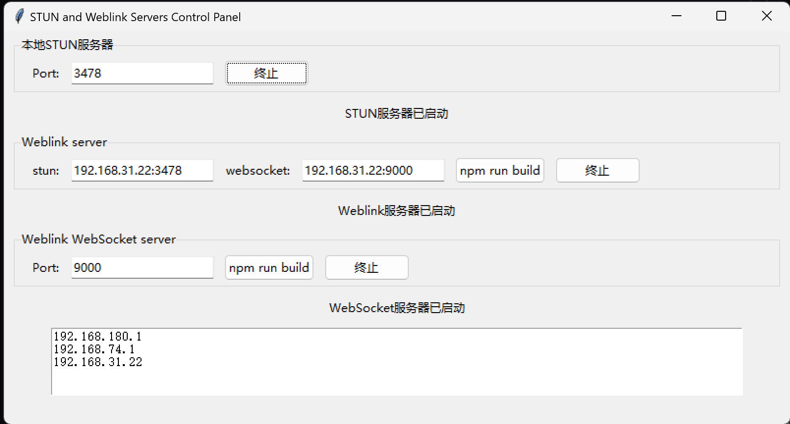
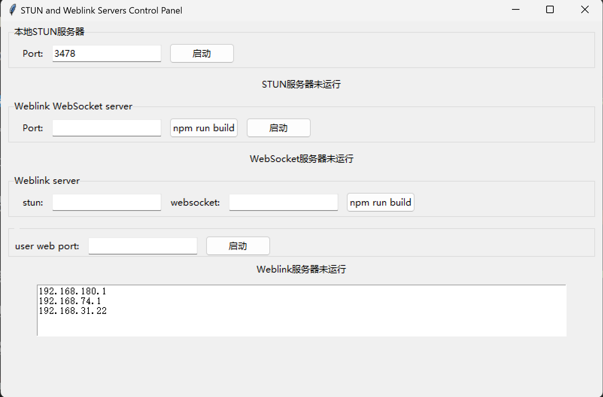

# weblink-local-server-gui
A python gui for weblink(P2P web chat and file transfer, file synchronization application using WebRTC)

- 本项目只提供一个启动服务的工具
- 原项目：https://github.com/99percentpeople/weblink.git
- 原作者bilibili：https://space.bilibili.com/10085789
- 原项目介绍视频（之一）：https://www.bilibili.com/video/BV1F6DUYBEuT

## 使用方法

- ```git clone --recurse-submodules https://github.com/Xxianna/weblink-local-server-gui.git```
- 下载npm和caddy。caddy.exe直接放在本目录下即可
- 首先，到两个子项目目录下分别运行 ```npm install``` （或使用cnpm）
- 随便安装一个python，用到tkinter、subprocess、threading、socket都是自带包
- ```python main.py```
- 然后进行配置，可选用网上的stun服务器和websocket服务器，也可使用本地的
- 如果使用本地，则[聊天软件覆盖的局域网地址:端口]得到本地的stun和websocket服务器配置地址
- 示例如图所示
- 配置完成后，先点击npm build按钮，固化配置到源码，再启动服务即可。三个服务都启动后，可访问聊天软件覆盖的局域网地址以访问聊天页面
- 更新：聊天端口也可设置了
- bug：目前终止无法实际生效，需要在任务管理器手动搜索caddy bun stun进程去终止



